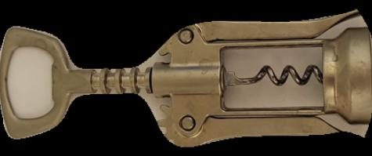

# Intelligent-placer-and-checker (ml2021)
SPbPU, Machine Learning, Intelligent Placer + Intelligent Checker

# Постановка задачи
Требуется реализовать `Intelligent checker`, который отвечает за вырезание объектов с изображений и создании тест кейсов для `Intelligent placer'a`. В каждом тест кейсе имеется фотография нескольких предметов на светлой горизонтальной поверхности и многоугольник. Соответственно, `Intelligent placer` должен понять можно ли расположить одновременно все предметы на плоскости так, чтобы они поместились в заданный многоугольник.

## Подробные описания `Placer'a` и `Checker'a`
Placer - https://docs.google.com/document/d/1o0lawEvLgmh9VrA5fUlOHFvo5JKxR4NThCFobmrKz60   
Checker - https://docs.google.com/document/d/1Tmn7BLnHXiAsdCpB_GQVDqUx3AoGEdfOoTyn3Eg3P7A

## Датасет фотографий
На этом датасете был протестирован алгоритм вырезания объектов и расстановки их на изображении заднего фона.

https://1drv.ms/u/s!AhASaINLAsMUirAUK_5D1w8eqNh3Hg?e=MrZ2NW

# Входные данные
На вход `Checker'a` подаются:
1. Полный путь до директории, в которой содержатся фотографии отдельных объектов на фоне листа а4.
2. Полный путь до фотографии заднего фона, на которую в дальнейшем будут накладываться вырезанные фотографии объектов.
3. Полный путь до конфиг файла, содержащего ограничения.

# Примеры работы `Checker'a`

### Пример вырезанных объектов
Оригинал

Вырезанный объект

 

Оригинал

Вырезанный объект

### Пример расположения нескольких вырезанных объектов

